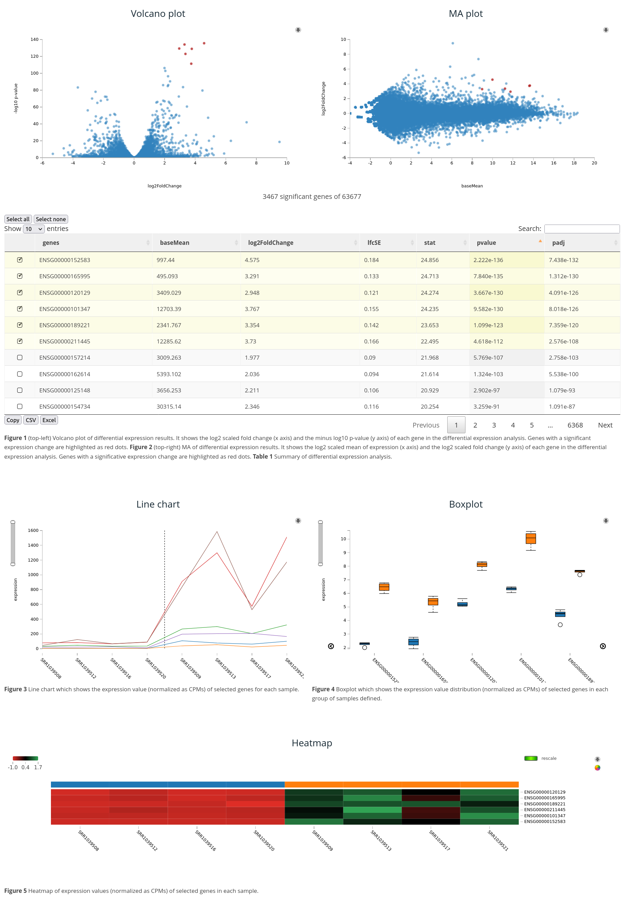

# Rvisdiff

Rvisdiff is an R/Bioconductor package which generates an interactive interface for the interpretation of differential expression results. It generates a local Web page which enables the exploration of statistical analysis results with the generation of auto-analytical visualizations. The package supports as input the output of popular differential expression packages such as DESeq2, EdgeR and limma.

# Install

```r
library(devtools)
install_github('BioinfoUSAL/Rvisdiff')
```

# Usage

```r
# Load example data
library("airway")
data("airway")
se <- airway
se$dex <- relevel(se$dex, ref="untrt")
countdata <- assay(se)

# Differential expression analysis
library("DESeq2")
dds <- DESeqDataSet(se, design = ~ cell + dex)
dds <- DESeq(dds)
dr <- results(dds, independentFiltering = FALSE)

# Rvisdiff report generation
library("Rvisdiff")
DEreport(dr, countdata, se$dex)
```


